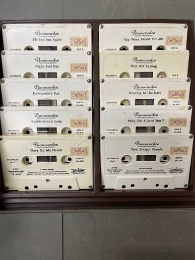
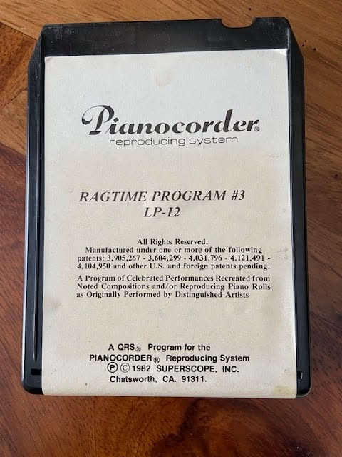
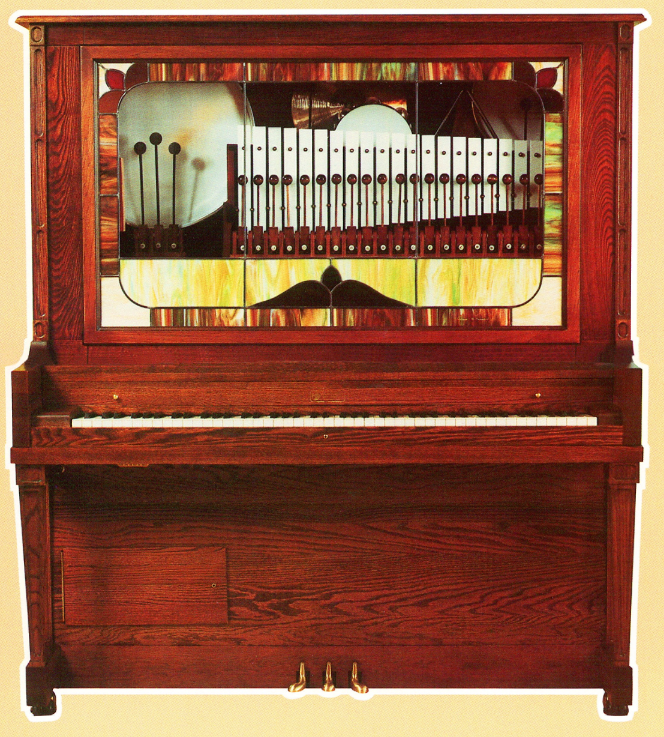

# General

The Pianocorder System is an electromechanical device that plays music by driving solenoid actuators attached to the keys of a piano or other compatible musical instruments. Musical performances are stored on magnetic tape and reproduced mechanically.

The goal of this project is to replace the original tape-based storage with a modern, reliable alternative while preserving compatibility with the existing Pianocorder hardware.

## Background

Two storage formats were used by the Pianocorder system:

- Compact cassette

  

- 8-track cartridge

  

I had the opportunity to help restore one of these systems:

This particular unit is a coin-operated entertainment piano (see the original [brochure](https://www.pianocorder.info/pdf/AMI_Entertainer_Brochure.pdf)) that uses 8-track cartridges for music playback.

Today, 8-track cartridges are both uncommon and difficult to obtain. Even when available, the magnetic tape has often deteriorated due to age, making reliable playback increasingly difficult.

These limitations provided the motivation for this project: to develop a modern replacement for the original tape medium while remaining fully compatible with the Pianocorder system.

## Work in Progress
- This [thesis](https://www.pianocorder.info/pdf/mark_fontana_thesis.pdf) goes into great detail about the pianocorder format.
According to it, back in the day, a lot of manual work was needed to create accurate and good performances. My software does not yet address topics like the inertia of the solenoids, the limited expression,...

- Currently I do not know how instruments like the Xylophone or the Drums are played. The [original documentation](https://www.pianocorder.info/pdf/pianocorder_schematics.pdf) does not describe this. I assume some bits (declared as "none_" in pianocorder.py) extend the original 128-bit frame.
